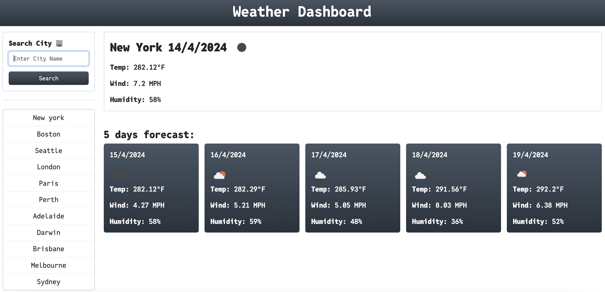
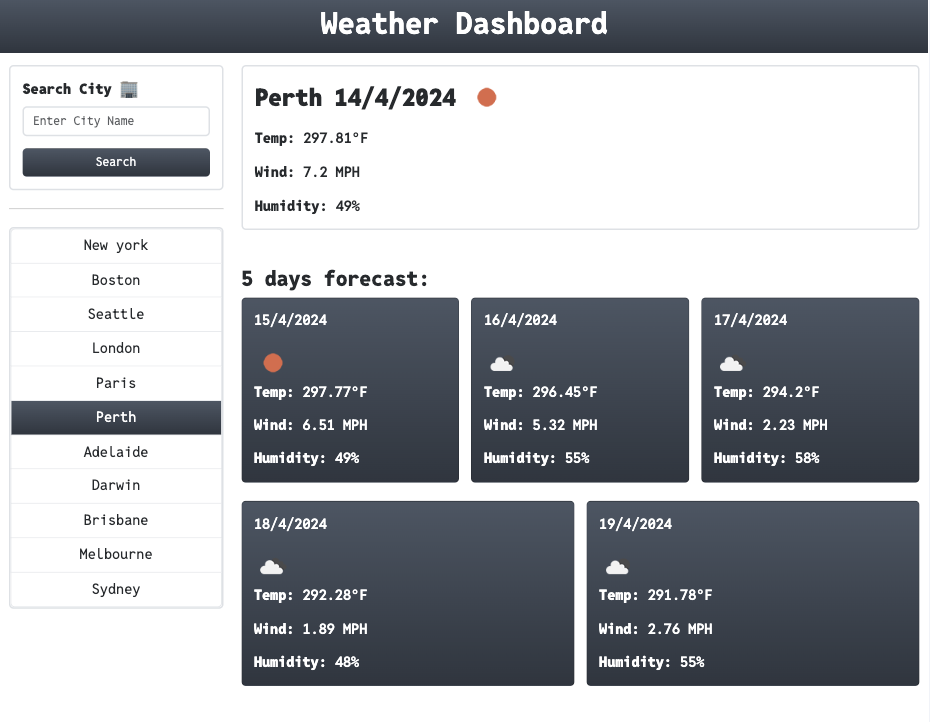

# Weather Dashboard App

Welcome to the Weather Dashboard app! This application allows you to check the current weather and 5-day forecast for any city around the world. Here's a detailed guide on how to use the app:

## Features

1. **Current Weather and 5-Day Forecast**: Get real-time weather information, including temperature, wind speed, and humidity, for the current day as well as a 5-day forecast.

2. **Location-Based Weather**: Fetch weather data based on your current location using geolocation.

3. **Search by City**: Search for weather information by entering the name of the city you want to check.

4. **Save Search History**: Save up to 10 cities in a list for quick access to their weather information.

## Live Demo

Click here for the live [Demo](https://pradeepkhanal23.github.io/weather-dashboard/).

## Screenshots

_Description: Homepage of the weather dashboard._

_Description: Quick fetch example using the saved cities from the list._

## How to Use

1. **Search by City**

   - Enter the name of the city you want to check in the search input field.
   - Click on the "Search" button to fetch weather information for the entered city.

2. **Save Search History**

   - After searching for a city, the app automatically saves it in the search history list.
   - Click on any city in the search history list to quickly fetch its weather information again.

3. **Get Weather Based on Current Location**
   -On page refresh, the geolocation api(web api) automatically fetches the information based on your current location and saves it in the local storage.

## Technologies Used

- HTML
- CSS
- JavaScript
- Bootstrap5
- OpenWeatherAPI

## API Usage

This app utilizes the [OpenWeather API](https://openweathermap.org/api) to fetch weather data. The API key used for accessing the weather data is stored directly in the JavaScript code for study purposes. However, in a production environment, it's recommended to store API keys securely using environment variables.

## Customization

You can customize the app by modifying the provided CSS and JavaScript files to match your desired design and functionality.

## Development Setup

To set up the development environment for this app, follow these steps:

1. Clone the repository to your local machine.
2. Open the `index.html` file in a web browser.
3. Get an API key from OpenWeatherAPI and replace it with your api key in the script file.
4. Start exploring the app and make changes as needed.

### Happy Weather Checking! 🌦️
